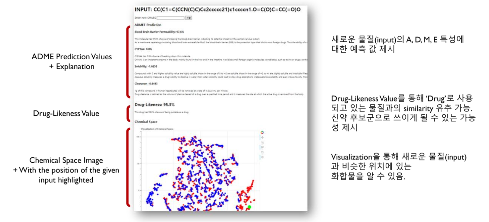

# drug-likeness
2023 Fall 창의적통합설계 w/ AIgenDrug



## Demo

```bash
docker pull kimkun07/aigendrug23
docker run -t -i -p 8000:5000 kimkun07/aigendrug23
```

**화합물 예시**

```
- Ibuprofen: CC(C)Cc1ccc(cc1)[C@@H](C)C(=O)O
- Abacavir: n3c1c(ncn1[C@H]2/C=C\[C@@H](CO)C2)c(nc3N)NC4CC4
- Glyburide: COc1ccc(Cl)cc1C(=O)NCCc1ccc(S(=O)(=O)NC(=O)NC2CCCCC2)cc1
- Levallorphan: C=CCN1CC[C@]23CCCC[C@H]2[C@H]1Cc1ccc(O)cc13
- Carperone: CC(C)NC(=O)OC1CCN(CCCC(=O)c2ccc(F)cc2)CC1
- Zolpidem: Cc1ccc(-c2nc3ccc(C)cn3c2CC(=O)N(C)C)cc1
- Carbuterol: CC(C)(C)NCC(O)c1ccc(O)c(NC(N)=O)c1
```
